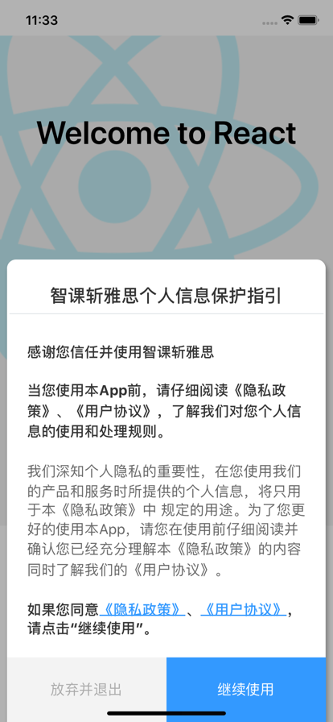
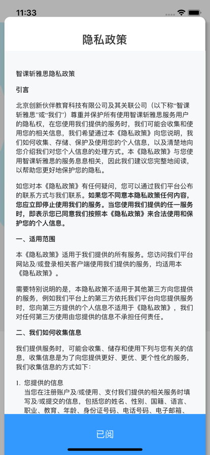

# react-native-protocal-view

## 安装

`$ npm install react-native-protocal-view --save`
`$ yarn add react-native-protocal-view`

## 使用

### 效果




### 使用方法
```javascript
import React from 'react';
import {
    StyleSheet,
    View,
    Text,
    TouchableOpacity,
} from 'react-native';
import {
    Colors,
} from 'react-native/Libraries/NewAppScreen';
import RNProtocalView from 'react-native-protocal-view';
import { px2dp, onePix } from './utils';
import { USER_PROTOCAL_BODY_HTML } from './user_protocal'
import { PRIVACY_PROTOCAL_BODY_HTML } from './privacy_protocal'

export default class ProtocalViewDlg extends React.Component {

	// step2a show agree dlg
	// step2a 显示同意对话框给用户
    onAgreeDlgPressed = () => {
        // return
        const protocalDlg = this.refs.protocalDlg;
        protocalDlg && protocalDlg.show();
    }

	// step2b show protocal directly 
	// step2b 直接显示协议
    onProtocalDlgPressed = () => {
        console.log('onProtocalDlgPressed', this.refs.protocalDlg);
        // return
        const protocalDlg = this.refs.protocalDlg;
        if (!protocalDlg) {
            return;
        }
        protocalDlg.showHtml('隐私政策', PRIVACY_PROTOCAL_BODY_HTML);
    }

    render() {
        return [(
            <View style={styles.body} key='1'>
                <TouchableOpacity style={styles.button}
                    onPress={this.onProtocalDlgPressed.bind(this)}>
                    <Text style={styles.buttonText}>Show ProtocalDialogOnly</Text>
                </TouchableOpacity>
                <TouchableOpacity style={styles.button}
                    onPress={this.onAgreeDlgPressed.bind(this)}>
                    <Text style={styles.buttonText}>Show AgreeDialog</Text>
                </TouchableOpacity>
            </View>
		), (//step1 add as a sibling view，to cover origin view
		    //step1 添加一个同级的view，以覆盖之前的view
            <RNProtocalView
                key='2'
                privacyHtml={PRIVACY_PROTOCAL_BODY_HTML}
                userProtocalHtml={USER_PROTOCAL_BODY_HTML}
                appName={'智课斩雅思'}
                ref="protocalDlg"
            />)
        ]
    }
}


const styles = StyleSheet.create({

    body: {
        justifyContent: 'flex-end',
        alignContent: 'center',
    },
    button: {
        padding: px2dp(20),
        margin: px2dp(15),
        backgroundColor: '#3399ff',
        borderWidth: onePix,
        elevation: 5,
        shadowOffset: { width: 2, height: 4 },
        shadowOpacity: 0.3,
        shadowColor: '#000000',
    },
    buttonText: {
        color: '#fff',
        fontSize: px2dp(20),
        textAlign: 'center'
    }
});

```
## 示例：
[protocal_view_demo](https://github.com/caojianfeng/protocal_view_demo) 